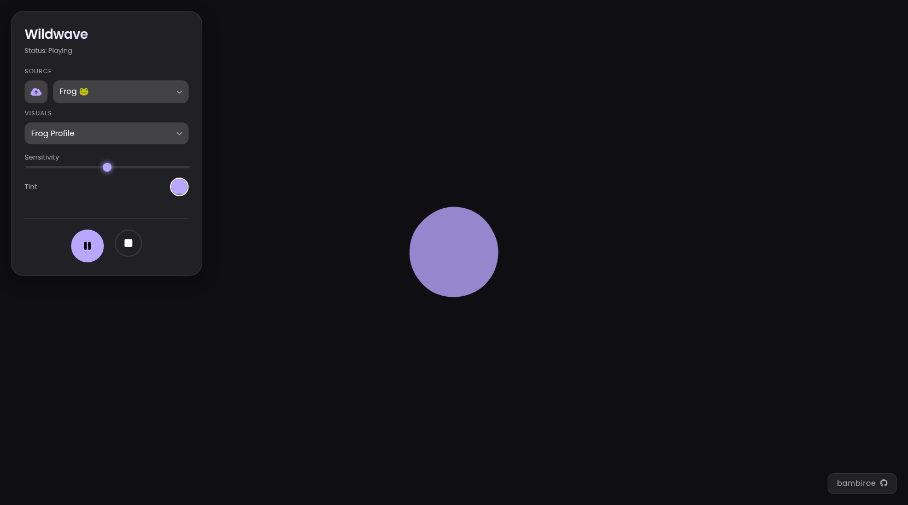

# 🪽 Wildwave

**Wildwave** is a real-time, interactive 2D visualization suite that transforms animal calls into procedural art.<br />
Using frequency analysis (FFT) and amplitude tracking, it creates unique visual signatures that mimic the biological characteristics of the animals being heard.

Created for the *Sound Production* course (RZP 25/26).



## ☁️ Visual Profiles

Wildwave doesn't just "react" to volume; it analyzes specific frequency bands to drive different visual behaviors:

* **🐦 Bird**: High-frequency tracking *(3000 - 8000 Hz)* creates calm, dancing notes.
* **🐋 Whale**: Low-frequency sub-bass analysis *(20 - 400 Hz)* generates deep, layered sea waves.
* **🐸 Frog**: Mid-range pulse detection *(400 - 2000 Hz)* drives an expanding vocal sac.
* **🐱 Cat**: Broadband frequency mapping *(100 - 2000 Hz)* renders oscillating whiskers.

## 🪻 Features

- **Real-time FFT Analysis**: Audio is processed using p5.FFT and Amplitude classes for precise responsiveness.
- **Interactive UI**: A modern glassmorphism control panel to adjust sensitivity, color tint, and animal profiles.
- **Flexible Input**: 
    - Use the built-in presets (Bird, Whale, Frog, Cat).
    - Upload your own `.mp3` or `.wav` files for custom experimentation.
- **Dynamic Color System**: Automatically switches to animal-specific colors or allows user-defined HSB tinting.

## ☁️ Tech Stack

- `p5.js`/`p5.sound`
- `JavaScript`
- `HTML5`/`CSS3`

## 🪻 Running Locally

1.  Clone the repository:
    ```bash
    git clone https://github.com/bambiroe/wildwave.git
    cd wildwave
    ```
2.  Start a local server (necessary for loading audio files):
    ```bash
    python3 -m http.server 8000
    ```
3.  Open `http://localhost:8000` in your browser.

## ☁️ How to Use

1.  **Select a Profile**: Choose an animal from the "Visuals" dropdown.
2.  **Choose Sound**: Select a preset from the "Source" dropdown or upload your own file using the cloud icon.
3.  **Adjust**: Use the **Sensitivity** slider to increase the visual reaction and the **Tint** picker to change the color.
4.  **Play**: Hit the play button and watch the sound come to life!

---
Developed by [bambiroe](https://github.com/bambiroe/)
